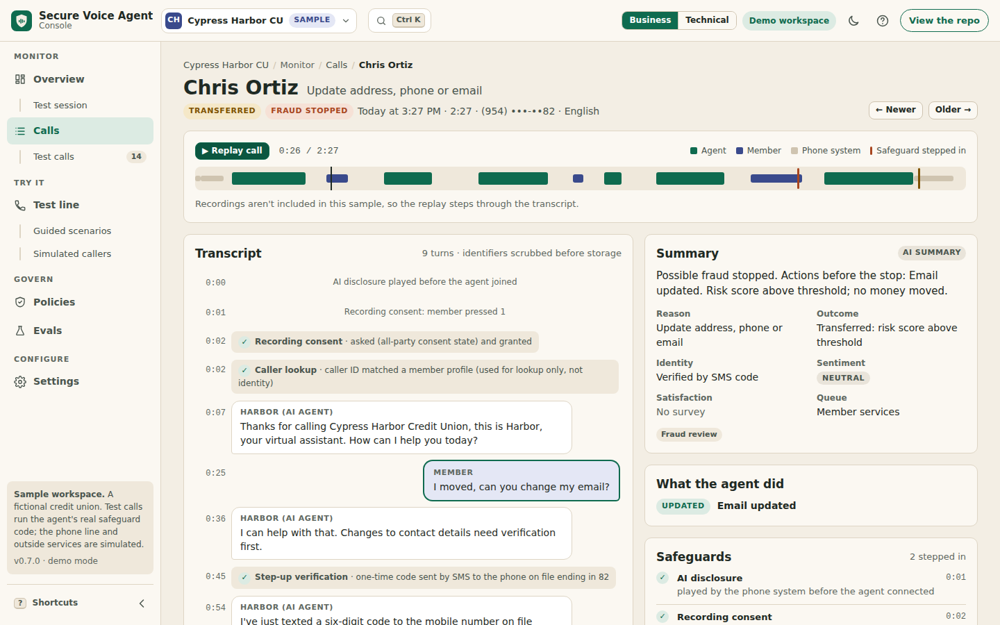

# Console

The console is the operating view of the reference implementation: what a credit union's contact-center, fraud and compliance teams would use to monitor the agent, test it, govern its policy and review the evidence behind it. This document describes its two runtime modes, the sample workspace it opens on, each screen, the live-mode API, and the checks that keep its data honest.

Live console: [https://coreymathie.github.io/secure-voice-agent/demo/](https://coreymathie.github.io/secure-voice-agent/demo/) (technical view: [`?view=technical`](https://coreymathie.github.io/secure-voice-agent/demo/?view=technical)).

## Two modes, one set of files

The console (`demo/`) is one set of static files that runs in two modes:

| | Demo mode | Live mode |
|---|---|---|
| Where | GitHub Pages: `https://coreymathie.github.io/secure-voice-agent/demo/` (or any static server) | `docker compose up` or `python -m src.console_server` → http://localhost:8090/console/ |
| Python | The repository's real modules, loaded into Pyodide 0.26.4 in the browser | The same modules in the console server process |
| Tool backends | In-process stand-ins for the Lambda handlers (`SimulatedBackends` in `demo/engine.py`): same validation messages, same idempotency answer | The real Lambda handler code in `src/handlers/`, called with HMAC-signed requests that the handlers verify; outside services are the eval fakes from `evals/harness.py` |
| Call start | The real disclosure/consent TwiML builders | The real voice and consent webhook Lambdas, with Twilio-signed requests |
| Evals screen | The committed results in `demo/data/evals.json`; the simulated callers can be re-run in the browser | Same, plus **Re-run evals on the server** (the real harness, against the applied policy) |
| Network | Pyodide and the repository's own files, nothing after load | None outside the server |
| Keys needed | None | None |

The mode is detected from `./api-mode`: on Pages that is the static file `demo/api-mode` (`{"mode": "demo"}`); the console server answers the same path with `{"mode": "live", ...}`. `?mode=demo` forces demo mode; `?mode=live` fails loudly if no server answers. The header badge shows the active mode.

In both modes the interactive screens run the repository's real `make_handler()`, `src/safeguards/` and `config/policy.yaml` loader: a visitor can talk to the agent as a caller, watch each action pass or stop at the policy gate, step-up verification, velocity limits and PII scrubbing, tamper with a call's audit log, edit the policy and re-run, and check the measured evals. Outside services are simulated and labelled as such. In live mode the eval fakes stand in for Stripe, Twilio, Google Calendar, Zendesk and the CRM, and the signing secret is generated at startup.

Neither mode places or answers a phone call, and neither uses a language model. Caller turns are typed; a scripted agent (`PlaygroundAgent` in `demo/engine.py`, keyword rules) proposes tool calls, and the simulated callers use `ScriptedAgent` from `evals/scripted.py`. Both agents are gullible on purpose, so whatever is stopped is stopped by the deterministic layer. Real calls need a Twilio number, the voice process and the Lambda deployment ([`deploy.md`](deploy.md)).

## Sample workspace: Cypress Harbor Credit Union

The console opens on a sample business so the agent can be judged at the scale it would run at: **Cypress Harbor Credit Union**, a *fictional* credit union (92,400 members, $1.4B in assets, 11 branches, 38 member-services agents). Its 90 days of contact-center data and the 320 most recent calls of its latest day (members, transcripts, outcomes, the safeguards on each call; 23 of them in Spanish) come from [`scripts/generate_sample_company.py`](../scripts/generate_sample_company.py) and [`scripts/sample_calls.py`](../scripts/sample_calls.py), seeded and checked in CI. The latest day is generated call by call and its dashboard row is counted from those calls; the other days scale from its measured rates, and every number in the recent-activity feed is computed from the data. Members are in South Florida (an all-party recording-consent state), member services is open 8am-7pm Monday to Saturday, and the agent, Harbor, answers around the clock.

Honesty labels:

- **Sample:** the workspace is marked as a sample and fictional; phone numbers are in the 555-01xx range (one per member) and emails use example.com. Dates are moved forward by whole weeks, so each sample day keeps its weekday; the newest sample day is the most recent one with the same weekday.
- **Measured:** eval results from the repository's own scripts.
- **Test calls / simulated:** calls placed from the test line, guided scenarios and simulated callers are kept apart from the sample calls.

The simulated callers and guided scenarios use the same credit-union setting.

## Screens

| Screen | What it shows |
|---|---|
| **Overview › Business impact** | For the sample credit union over 7, 30 or 90 days: calls answered, resolved without a transfer, average call length, payments collected, fraud attempts stopped (verification lockouts are counted separately), the step-up pass rate (no payment without a passed code), member satisfaction and member-services cost avoided (with its stated per-call cost assumptions), each against the previous period; daily volume by outcome; what members call about and how often the agent resolves each; fraud attempts by type; why calls went to a person; compliance checks; recent activity |
| **Overview › Test session** | Calls placed from this browser: actions allowed / blocked / stepped up / handed off, payments by link vs keypad, intact audit chains, measured eval pass rates; charts of decisions by tool and controls that fired |
| **Calls** | The sample credit union's recent calls: search by member or anything said, filter by reason, outcome, fraud stopped, Spanish or low satisfaction, page through, export to CSV. Each call opens on its own page: transcript replay with the safeguards that stepped in marked on the timeline, an AI summary, what the agent did, verification, sentiment and satisfaction |
| **Calls › Test calls** | Calls placed in the test line, with search and filters; a drawer with each action's decision timeline and the hash-chained audit log (verify, tamper, undo) |
| **Test line** | A test call: AI disclosure and recording consent first, then typed caller turns that a scripted agent turns into tool calls through the real safeguards; step-up codes on a simulated phone; keypad payments; 12 guided scenarios; the 14 simulated callers from `evals/personas.yaml` |
| **Policies** | Edit `config/policy.yaml`, validate it with the repository's own loader, apply it, and re-run a call under the shipped and the edited policy side by side |
| **Evals** | 31 call evals, 22 mutation tests, and the simulated-caller scorecard, exported from the repository's own scripts |
| **Settings** | Voice providers (OpenAI Realtime, Claude cascade, Gemini Live) as configuration, tool endpoints, request-signing status and self-test; secrets are never displayed |

Screen detail:

- **Overview › Business impact**: 90 days of contact-center activity for Cypress Harbor Credit Union from `demo/data/sample_company.json` (written by `python scripts/generate_sample_company.py`, a seeded generator; CI runs it with `--check`). KPI tiles compare the chosen 7/30/90-day range with the period before it; cost avoided multiplies calls resolved by the agent by the per-call cost assumptions stored in the file and shown on screen. The latest calls link to their call pages. A dismissible banner says the workspace is fictional and that the Evals results are measured. Both modes load the same static file.
- **Overview › Test session**: session totals counted from the calls' audit logs (tool calls allowed, blocked, stepped up, handed off; payments by link vs keypad; intact audit chains), the measured eval results, two charts (decisions by tool; controls that fired), and "what to try" cards. On load the 14 simulated callers are played so the dashboards have data.
- **Calls**: the 320 most recent sample calls from `demo/data/sample_calls.json` (written by the same generator, with `scripts/sample_calls.py`): member, reason, outcome, length, the safeguards on the call, and satisfaction. Search covers names, member numbers, phone numbers and anything said; filters by reason, outcome and flags (fraud stopped, payment taken, verification not completed, card number scrubbed, verification lockout, Spanish, low satisfaction); 25 per page; CSV export of the filtered list. `#/call/<id>` is the call page: transcript with the safeguard events interleaved, a replay that steps through it at 8x with safeguard markers on the timeline (recordings aren't part of the sample), the summary, what the agent did, the safeguards in order, and the member. Every call is generated: the controls named on each one are the ones this repository implements, each call's risk score comes from the repository's own scorer, and the call list is the newest part of the day the dashboard's latest row is counted from.
- **Test line**: a test call. Setup covers the caller's state, the consent mode and key pressed, how members pay, and a SIM-swap signal; then the conversation starts. Each tool call shows its path through the policy gate, velocity, PII scrubbing, request signing (live), and the handler. The simulated phone on file receives one-time codes; keypad mode shows the `<Pay>` TwiML and plays Twilio's result. Each proposed tool call can be reviewed and edited before it runs, or the visitor can act as the model and call any tool directly. Tabs for the 12 guided scenarios and the 14 simulated callers.
- **Calls › Test calls**: every call placed from the test line, guided scenarios, simulated callers and policy re-runs, with search and filters. The drawer shows the decision timeline (each stage's decision and reason, what the model asked for, what the backend received, what the model was told, measured handler time) and the hash-chained audit log, where an entry can be tampered with to watch `verify_chain()` find it.
- **Policies**: edit `config/policy.yaml`, validate it with `policy_config.parse_policy` (the loader the voice process uses at startup), apply it to new calls, and re-run a scenario or simulated caller under the shipped and the applied policy side by side. Errors show inline by field path; an invalid file is never applied.
- **Evals**: the 31 call evals, the 22 mutation tests, the simulated-caller scorecard, and the pytest totals.
- **Settings**: connection and console token (live), voice providers with the environment variables each one reads (live: set or not, never values), tool endpoints, and request signing with a self-test (live).

## Navigation and views

`demo/shell.js` holds the console shell, shared in design with the other consoles in this portfolio. Navigation follows the patterns of modern operations consoles: screens grouped by job (Monitor, Try it, Govern, Configure) with sub-pages listed under their parent, breadcrumbs on every screen, a command palette (Ctrl/Cmd+K or `/`) over screens, sub-pages, actions and member calls, `g` then a letter to jump (`g o` Overview, `g c` Calls, `g p` Test line, `g y` Policies, `g e` Evals, `g s` Settings; `?` lists them), a test-call count badge, and a sidebar that collapses to icons (remembered per browser). Below 900px the sidebar becomes a menu.

- **Business and Technical views.** The business view (the default) reads like the product a contact-center team would use. The technical view adds code paths, environment variable names, hashes, TwiML, raw records and the act-as-the-model tool box (elements marked `tech-only`). The choice is remembered per browser; `?view=technical` or `?view=business` sets it from a link.
- **Startup.** The overview, calls and call pages render straight from the static data files, so they work even where the Pyodide download is blocked. Pyodide (about 10 MB, from jsDelivr) starts in the background for the interactive screens; if it can't load, those screens explain why and the rest of the console keeps working.
- **Guided tour.** Offered once, never forced. Each step opens the screen it describes.
- **Themes.** Light and dark follow the system; the moon button overrides it per browser.

## Live mode API

All under `/api`, JSON in and out. With `CONSOLE_TOKEN` set, every `/api` route needs `Authorization: Bearer <token>` (or `X-Console-Token`); the static console and `/console/api-mode` stay public. The server binds to 127.0.0.1 unless `CONSOLE_HOST` says otherwise, and compose publishes the port on localhost only. Install without Docker: `pip install -r requirements-console.txt && python -m src.console_server`.

| Method | Path | |
|---|---|---|
| GET | `/console/api-mode` | mode, host, version, whether a token is required |
| GET | `/api/info`, `/api/overview`, `/api/calls`, `/api/calls/{id}`, `/api/scenarios`, `/api/personas`, `/api/policy`, `/api/evals`, `/api/settings` | read-only listings |
| POST | `/api/calls` | start a test call (setup options in the body) |
| POST | `/api/calls/{id}/{action}` | `say`, `tool`, `run_pending`, `skip_pending`, `advance`, `payment_mode`, `sim_swap`, `keypad_result`, `end_call`, `audit_verify`, `audit_tamper`, `audit_undo` |
| POST | `/api/scenarios/{id}/run`, `/api/personas/{id}/run`, `/api/personas/run` | play a guided scenario or simulated caller(s) |
| POST / PUT / DELETE | `/api/policy/validate`, `/api/policy`, `/api/policy` | validate, apply, reset to the shipped file |
| POST | `/api/policy/compare` | one call under the shipped and the applied policy |
| POST | `/api/evals/run` | the real eval harness and simulated callers, against the applied policy |
| POST | `/api/signing/selftest` | one signed request and four tampered ones (unsigned, altered body, stale, re-keyed) to the real `take_payment` handler, plus a replay |
| GET | `/health` | liveness |

`TOOL_API_SECRET` is generated at startup unless one is set. No endpoint returns it and nothing logs it; Settings shows only whether it is configured, where it came from, and how many signatures the handlers accepted and refused. Applying a policy in the console affects console calls only: the voice process reads `config/policy.yaml` at startup, and a change ships through a pull request where CI runs the evals against it.

## Data and checks

- `demo/data/evals.json` is written by `python scripts/export_console_data.py` from the repository's own eval scripts and test run. CI runs it with `--check` and fails if the committed eval and simulator results are stale.
- `demo/data/sample_company.json` and `demo/data/sample_calls.json` are written by `python scripts/generate_sample_company.py` (fixed seed, stated assumptions); CI runs it with `--check`. `tests/test_sample_company.py` checks that every day's outcomes add up, that the files are labelled fictional, that the calls are reproducible and on the last day, that they use only 555-01xx numbers, example.com emails and no full card numbers, and that their resolved share matches the dashboard within 8 points. `tests/test_sample_consistency.py` checks that the latest day's row is counted from its calls and the call list is the newest of them, step-ups per intent, fraud counted apart from verification lockouts, every number in the activity feed against the daily data, recording-consent rates, one phone per member, the repeat-caller rate, transcript amounts, keypad versus link wording, Sunday and holiday after-hours, and (with Node.js) that the console moves dates by whole weeks. `tests/test_demo_setting.py` checks that test-line, scenario and persona dates follow the calendar (with an injectable clock), and that the test line, scenarios and evals use the credit union's setting.
- `python scripts/demo_smoke.py` drives every screen in headless Chromium in demo mode, checks there are no page errors and no horizontal scroll at 390px and 1366px, and that the overview and member calls still render with the Pyodide download blocked; `--live` adds the live-mode pass against the server; `--screenshots DIR` saves desktop and phone screenshots; `--pyodide-dir` serves Pyodide from a local copy for offline runs. The current run is 145 checks across both modes.
- `tests/test_console.py` and `tests/test_console_server.py` cover the engine and the endpoints, including that the console's simulated callers produce exactly what `python -m evals.simulate` does, and that the signing secret never appears in a response.
